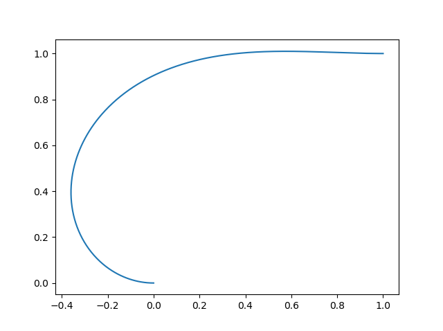
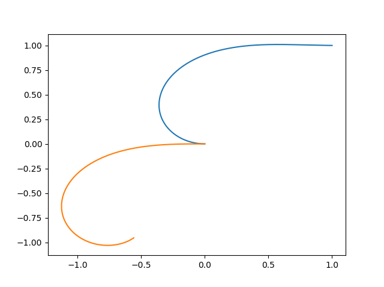
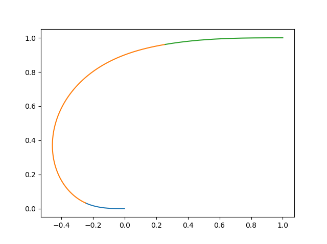

Basic Usage
===========

The Clothoid class provides two initialization methods:

*	StandardParams
*	G1Hermite

G1Hermite is a special initialization function that computes the unique clothoid that joins two points with two prescribed tangent angles. [1]_

StandardParams simply assumes you already know the desired starting point, starting tangent, starting curvature, curvature rate, and arc length of the clothoid segment you wish to construct.  
It then takes each of these as arguments.

Let's illustrate the usage with examples.  Suppose you are an airplane pilot taking off from a runway facing due west at point (0,0) and the destination airport has a runway facing due east at (1,1).  
You're a particularly lazy pilot, and it's difficult to move your stick to steer quickly in one direction or the other, so you start to wonder whether you can only steer in one direction at a constant rate for the entire flight and still arive in the right orientation in your destination.
Fortunately, you have a laptop in the cockpit equipped with the pyclothoids library, and you quickly punch in the following code:

::
	
	from numpy import pi
	import matplotlib.pyplot as plt
	from pyclothoids import Clothoid
	clothoid0 = Clothoid.G1Hermite(0, 0, pi, 1, 1, 0)
	plt.plot( *clothoid0.SampleXY(500) )
	print(clothoid0.dk, clothoid0.KappaStart, clothoid0.KappaEnd)
	
You called the Clothoid.G1Hermite method to interpolate two points and two tangents with a clothoid, and passed it the arguments (x0,y0,t0,x1,y1,t1), 
then plotted the resulting path and printed the clothoid properties that interested you.  You find that if you leave the runway with a curvature of -3.093 and turn with a rate of 1.506,
you will align perfectly with the runway at your final destination, with a curvature of 0.3201.  Using the matplotlib [3]_ package, you are even able to plot the resulting path!

	
But wait a moment, you realize that you've made a mistake.  You'll need to leave and enter each runway with zero curvature, but if your path only consists of one clothoid you will not be able to meet those constraints!
You wonder how much different the path will be if you start with zero curvature instead of the -3.093 that you need.  You decide to return to your trusty pyclothoids script and add a few lines to check this out:

::

	x0, y0, t0, k0, dk, s = clothoid0.Parameters
	clothoid1 = Clothoid.StandardParams(x0, y0, t0, 0, dk, s)
	plt.plot( *clothoid1.SampleXY(500) )
	

	
Gah!  How catastrophic, this path is nothing like the one you wanted and your plan to only move the stick in one direction at one rate is foiled, 
but you're still lazy and you wonder how few times you would need to change steering directions during your flight.  Fortunately, you remember the function SolveG2 from pyclothoids will do this for you.
It uses heuristics to generate three fair clothoids that smoothly interpolate points, tangents, and curvatures at each end [2]_.  The path it generates isn't optimal or minimum length in any sense,
instead it is designed to be feasible and pleasing to the eye.  If you wanted an optimal path you might want to combine this library with a numerical optimization routine, perhaps "minimize" from SciPy, 
and tailor the optimization to your specific problem.  However, in this case the feasible clothoids returned by SolveG2 will suit you just fine.

::

	clothoid_list = SolveG2(0, 0, pi, 0, 1, 1, 0, 0)
	plt.figure()
	for i in clothoid_list:
		plt.plot( *i.SampleXY(500) )
		

		
There you have it, you're done...  or so you thought!  Once you've traveled a distance of 0.25, air traffic control comes on the radio and demands to know your current position and heading.
Being the lazy pilot that you are, you forgot to pay attention during pilot school and you have no idea how to read your instrumentation readouts.  You panic, because you've finally been exposed for the fraud that you are.
But wait, is there some way you could use the path you planned before taking off to deduce this information?  You know you've traveled a distance of 0.25, so you decide to just call the X, Y, and Theta methods on your clothoid paths
to query the position and the tangent angle of the path after that distance.

::

	clothoid2 = clothoid_list[0]
	x_m = clothoid2.X(0.25)
	y_m = clothoid2.Y(0.25)
	t_m = clothoid2.Theta(0.25)
	print(x_m, y_m, t_m)
	
You now have the x, y, and tangent angle to your path at the current point.  You quickly convert the radians to degrees and radio back to air traffic control, and they confirm that these values are correct.
You breathe a sigh of relief and wipe the cool sweat from your brow.  Your job has been saved, and it's all thanks to pyclothoids.  You make a note to contact the library author when you land and share your story,
since you know he'll appreciate hearing that his work has benefitted someone in need.

.. [1] Bertolazzi, E., & Frego, M. (2015). G1 fitting with clothoids. Mathematical Methods in the Applied Sciences, 38(5), 881-897.

.. [2] Bertolazzi, E., & Frego, M. (2018). On the G2 Hermite interpolation problem with clothoids. Journal of Computational and Applied Mathematics, 341, 99-116.

.. [3] Hunter, J. D. (2007). Matplotlib: A 2D graphics environment. Computing in science & engineering, 9(3), 90-95.